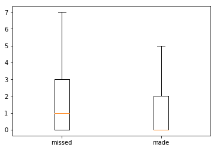
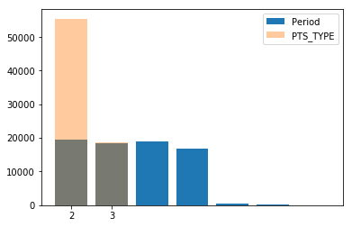

# Assignment 2 Delivery

Please follow the provided structure carefully and complete all of the sections described below. The parts that you need to complete are marked with *TODO*.

## Personal information

**Name**: aribo17

List the GitHub usernames of your team here. If you are working alone, then write your GitHub username as the team leader and leave the list of additional team members empty.

**Team leader**: aribo17

**Additional team members**: SCassandraES, Bibben

If you are working as a part of a team, only the a single person, the *team leader* needs to submit the report. If that is not you, then do not edit anything below this point.

----

## Part A: Data exploration

It must be possible to click **[here](1_Exploring_data.ipynb)** and reach the notebook corresponding to Part A.  Running all its cells should fully proceed without errors.

Complete the table with the attribute name(s) chosen for the given requirements.

| Attribute | Mean | Median | Range | Variance | AAD | MAD | IQR |
| --- | --- | --- | --- | --- | --- | --- | --- |
| SHOT_NUMBER | 6.3614409175349325 | 5.0 | 35.0 | 20.555553764073327 | 3.6105975425099235 | 3.3614409175349325 | 6.0 |
| DRIBBLES | 1.9388444659828232 | 0.0 | 30.0 | 11.302809051746113 | 2.230453385850392 | 1.9388444659828232 | 2.0 |
| SHOT_CLOCK | 12.552404221522226 | 12.4 | 24.0 | 32.96654433069982 | 4.736406998578795 | 4.247595778477775 | 8.5 |

| **Requirement** | **Chosen attribute(s)** |
| -- | -- |
| DRIBBLES ||
| PERIOD & PTS_TYPE|  |
|SHOT_NUMBER & DRIBBLES scatterplot |  |

## Part B: Decision tree implementation

1 - Report on the classification accuracy, as appearing for your team in the mandatory Kaggle leaderboard, of your predictions output. This submitted output must be the same file as produced by your decision tree.

Write the name of the corresponding output file in the table, as well as the name of the file with the source code that was used for producing that output file. These files should be pushed to your repository. (We use some example names; replace any of them by the actual name you gave it if necessary.)

| **Output file** | **Code** | **Accuracy** |
| -- | -- | -- |
| `output.csv` | `2_Decision_tree.ipynb` | 0.55659 |

2 - Identify the top attribute that is used by your decision tree classifier.

**Top attribute:** SHOT_DIST

3 - Only if your final code implements any of the mentioned enhancements, and you observed an improvement by using it, report in a few words what is the enhancement. (Otherwise leave it as it is.)

**Possible enhancement:** In ID3 func.: Changed leaf nodes values from default_class to target. Accuracy went from 50% to 55%.

## Part C: Advanced classifiers

1 - Report on the classification accuracy, as appearing for your team in the optional Kaggle leaderboard, of your predictions output using an advanced classifier. This submitted output must be the same file as produced by the classifier you chose with some given parameter values.

Write the name of the corresponding output file in the table, as well as the name of the file with the source code that was used for producing that output file. These files should be pushed to your repository. (We use some example names; replace any of them by the actual name you gave it if necessary.)

| **Output file** | **Code** | **Accuracy** |
| -- | -- | -- |
| `predictionGradientBoosting.csv` | `3_Alternative_classifiers.ipynb` | 0.59046 |

2 - Report the classifier and its parameter(s) settings for the submitted predictions (add more line pairs of *Parameter* and *Parameter value* if needed):
  - Classifier: GradientBoostingClassifier
  - Parameter: max_depth
    - Parameter value = 4
  - Trained on 4/5 of the training set
